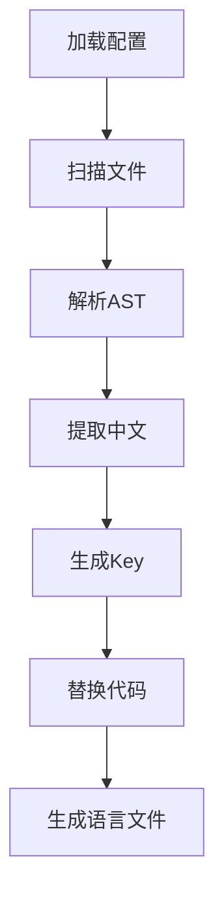
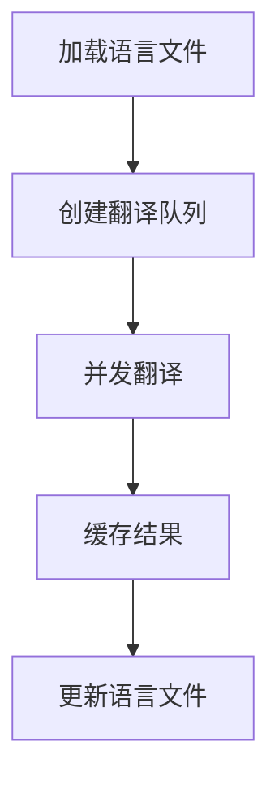

# i18n-xy 技术架构文档

## 一、项目结构

```
docs/
src/
  ├── ast/              # AST解析和转换
  │   ├── index.ts      # AST处理入口
  │   ├── parser.ts     # AST解析器
  │   ├── visitor.ts    # AST访问器
  │   └── generator.ts  # 代码生成器
  ├── cli.ts            # CLI入口和命令定义
  ├── config/           # 配置相关
  │   ├── default.config.ts     # 默认配置（配置不全，仅包含默认的配置）
  │   ├── i18n.config.ts        # 用户配置示例（全部的配置示例，包含注释）
  │   ├── index.ts              # 配置加载和验证，用户配置+默认配置合并
  │   └── type.ts               # 配置类型定义
  ├── translation/      # 翻译服务
  │   ├── cache.ts      # 翻译缓存
  │   ├── cli.ts        # 翻译命令
  │   ├── index.ts      # 翻译服务入口
  │   ├── manager.ts    # 翻译管理
  │   ├── providers/    # 翻译提供商
  │   │   └── baidu.ts  # 百度翻译
  │   └── queue.ts      # 翻译队列
  ├── utils/           # 工具函数
  │   ├── fs.ts        # 文件操作
  │   ├── logger.ts    # 日志工具
  │   ├── pattern.ts   # 文件匹配
  │   └── gen-key-value.ts  # Key生成，将原始字符串，生成key，value，params（如果有）进行返回
  └── index.ts         # 模块导出

exmaple/              # 测试代码/测试生成产物目录
  ├── demo/           # 测试示例代码文件夹，需要包含js,jsx,ts,tsx等各个场景的文件内容
  └── temp/           # 测试生成产物代码
```

## 二、核心模块实现

### 1. AST处理（src/ast/）
- **技术方案**：
  - @babel/parser：支持JSX/TS的解析器
  - @babel/traverse：AST节点遍历
  - @babel/types：AST节点操作
  - @babel/generator：代码生成
- **功能职责**：
  - 解析源代码为AST
  - 遍历AST查找中文字符串
  - 替换中文字符串为i18n调用
  - 生成转换后的代码

- **实现细节**：
  1. **解析器（parser.ts）**
     ```typescript
     interface ParserOptions {
       sourceType: 'module' | 'script';
       plugins: ['jsx', 'typescript', ...];
     }
     
     class Parser {
       parse(code: string, options?: ParserOptions): AST;
       parseExpression(code: string): Expression;
     }
     ```

  2. **访问器（visitor.ts）**
     ```typescript
     interface Visitor {
       StringLiteral(path: NodePath<StringLiteral>): void;
       TemplateLiteral(path: NodePath<TemplateLiteral>): void;
       JSXText(path: NodePath<JSXText>): void;
     }
     ```

  3. **代码生成（generator.ts）**
     ```typescript
     interface GeneratorOptions {
       retainLines: boolean;
       compact: boolean;
     }
     ```

- **技术难点**：
  1. 模板字符串中的变量处理
  2. JSX属性中的表达式处理
  3. 保持代码格式和注释

### 2. 配置管理（src/config/）
- **功能**：加载和验证配置
- **技术方案**：
  - zod：配置验证
  - deepmerge：配置合并
  - cosmiconfig：配置文件加载

### 3. 翻译服务（src/translation/）
- **功能**：文本翻译和管理
- **技术方案**：
  - axios：HTTP请求
  - p-queue：并发控制
  - quick-lru：翻译缓存

### 4. 文件处理（src/utils/）
- **功能**：文件操作和工具函数
- **技术方案**：
  - fs-extra：文件操作
  - fast-glob：文件匹配
  - mkdirp：目录创建

### 5. Key生成（src/utils/gen-key-value.ts）
- **功能**：生成翻译key
- **技术方案**：
  - pinyin-pro：拼音转换
  - string-hash：hash生成

## 三、技术栈选择

### 1. 核心依赖
```json
{
  "@babel/parser": "^7.x",
  "@babel/traverse": "^7.x",
  "@babel/types": "^7.x",
  "@babel/generator": "^7.x",
  "commander": "^9.x",
  "zod": "^3.x",
  "axios": "^1.x",
  "fs-extra": "^11.x",
  "pinyin-pro": "^3.x",
  "p-queue": "^7.x"
}
```

### 2. 开发环境
```json
{
  "typescript": "^5.x",
  "tsup": "^7.x",
  "eslint": "^8.x",
  "prettier": "^3.x"
}
```

## 四、关键流程

### 1. 提取流程


### 2. 翻译流程


## 五、性能考虑

### 1. 文件处理
- 使用流式处理大文件
- 缓存AST解析结果
- 并行处理独立文件

### 2. 翻译优化
- LRU缓存翻译结果
- 控制API并发
- 批量翻译请求

### 3. 内存管理
- 及时释放AST对象
- 限制并发处理数
- 分批处理大量文件 