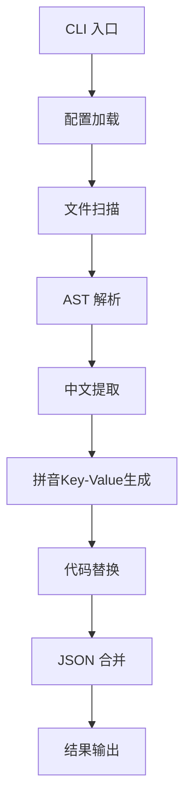

### **PRD + 技术架构文档：React I18n String Extractor CLI**  

**目标**：自动扫描React项目中的中文特征字符串，替换为`$t(key)`调用，并生成拼音Key的JSON语言文件。

---

### **一、核心需求分解**
1. **输入范围**  
   - 支持文件类型：`js`/`jsx`/`ts`/`tsx`
   - 需处理的中文特征：  
     - 包含汉字的字符串才需要提取
     - 混合情况需要全部提取（如`中文abc`需提取"中文中文abc"部分）
   - case场景
     - JSX属性（静态`attr="值"`、动态`attr={value}`）  
     - 文本节点（`
中文
`）、动态文本节点1（`
新增{formType}
`）、动态文本节点2（`
`新增${formType}`
`）
     - 三元表达式（`isOk ? '是' : '否'`）  
     - 条件判断（if(a === '中文')）  
     - 函数传参（a("中文")、 function a(name = "中文")）
     - 模板字符串（`新增${formType}`）
     - 其他复杂/混合情况，比如模板字符串/加号/单双引号，以及这些场景在任何jsx的属性和文本节点中出现的情况
   - **排除**：TS类型定义、注释、没有包含任何一个汉字的文本  

2. **输出要求**  
   - 代码替换：中文替换为`$t('key')`，保留原逻辑（如动态属性需保持`{}`包裹）  
   - JSON文件生成：  
     - Key生成规则：
       - 基本规则：中文→拼音（去除非汉字字符），如"提示" → `"ti_shi"`
       - 重复Key处理：添加hash后缀（如`ti_shi_a1b2`）
       - 长文本Key：取前10个汉字转拼音+hash（如`zhe_shi_yi_ge_hen_he2f`）
     - Key生成配置：
       - 支持自定义key前缀
       - 支持自定义分隔符（默认"_"）
       - 支持配置是否重用相同文本的key
       - 支持配置拼音转换选项（声调类型、输出格式）
   - 输出目录：
     - 默认输出到`src/locales/zh-CN.json`
     - 支持配置输出目录
     - 支持临时目录输出（不修改源文件）

3. **配置能力**  
   - 初始化配置：
     - `init`命令生成默认配置文件
     - 支持自定义配置文件路径
     - 支持配置文件合并（用户配置优先）
   - 文件处理配置：
     - 支持include/exclude文件匹配模式
     - 支持临时目录输出
   - 翻译配置：
     - 支持配置目标语言（displayLanguage）
     - 支持配置翻译服务（百度翻译）
     - 支持并发控制和重试策略
   - 日志配置：
     - 支持配置日志级别（minimal/normal/verbose）
     - 支持开启/关闭日志输出

4. **健壮性**  
   - 语法保护：AST操作确保替换后代码语法正确  
   - 边界处理：中英文混合、转义字符、多行文本  

---

### **二、技术架构设计**
#### **1. 整体架构**  

#### **2. 技术栈选择**
| **模块**         | **技术方案**                             | **说明**                                                                 |
|-------------------|------------------------------------------|--------------------------------------------------------------------------|
| **AST解析**       | Babel Parser (`@babel/parser`)           | 支持JSX/TS语法树解析，精准定位代码位置         |
| **遍历替换**      | Babel Traverse (`@babel/traverse`)       | 安全修改AST节点，避免破坏代码逻辑                                        |
| **拼音转换**      | `pinyin-pro`                             | 轻量级中文转拼音库，支持声调/无符号输出                   |
| **文件处理**      | `fs-extra` + `fast-glob`                 | 跨平台文件操作+快速文件匹配                                              |
| **命令行框架**    | `commander` + `inquirer`                 | 交互式命令+参数解析                      |
| **字符串哈希**    | `string-hash`                            | 生成长文本Key的短哈希                                                    |

---

### **四、任务拆分与执行**

1. **Phase 1：基础框架初始化INIT**  
   - 使用pnpm + ts + node实现
   - 使用cli生成项目基本结构，包含但不限于pnpm init，ts init，目录初始化
1. **Phase 2：配置加载模块（src/config）**
   - 定义ts  
   - 加载默认配置（json）和用户指定配置文件（通过cli参数指定），并合并配置（lodash-es），用户配置优先
   - 导出提供给其他模块使用
2. **Phase 3：文件操作相关（src/utils/fs）**
   - 定义ts
   - 根据配置参数，实现通用的文件读写，目录遍历/创建等能力
   - 导出提供给其他模块使用
2. **Phase 4：AST解析并扫描(src/ast/)**
   - 定义ts
   - 使用utils/fsti工的方法获取需要解析的文件
   - 搭建AST解析，需要支持js，jsx，ts，tsx
   - 导出解析的内容给扫描引擎使用
2. **Phase 5：解析生成Key-Value(src/utils/gen-key-value)**
   - 定义ts
   - 根据提取的中文特征字符串，解析出key和value
   - 解析出特征字符串中的所有汉字（截取10个汉字）使用pinyin-pro进行翻译
   - 重复key直接使用index添加后缀
   - 导出解析的内容给扫描引擎使用
3. **Phase 6：替换逻辑**  
   - 使用$t(key)替换原有字符串，需要保证代码逻辑正确，比如动态属性，静态属性等所有场景
   - 输出JSON合并与写入
   - 输出修改后的代码文件并写入到指定位置（不指定就是原位置覆盖）
2. **Phase 7：实现cli组合**  
   - 实现中文特征（至少包含一个中文字符）提取（正则+AST双校验）  
   - 开发拼音Key生成器（支持重复/长文本）  
4. **Phase 8：测试验证**  
   - 不要构建单元测
   - 构建测试Demo覆盖所有Case  
   - 语法兼容性检查（ESLint校验）  

通过分层设计，每阶段可独立验证，确保最终实现精准匹配需求。使用社区成熟工具链（Babel/commander/pinyin-pro）保障稳定性，AST操作避免正则替换的语法风险。